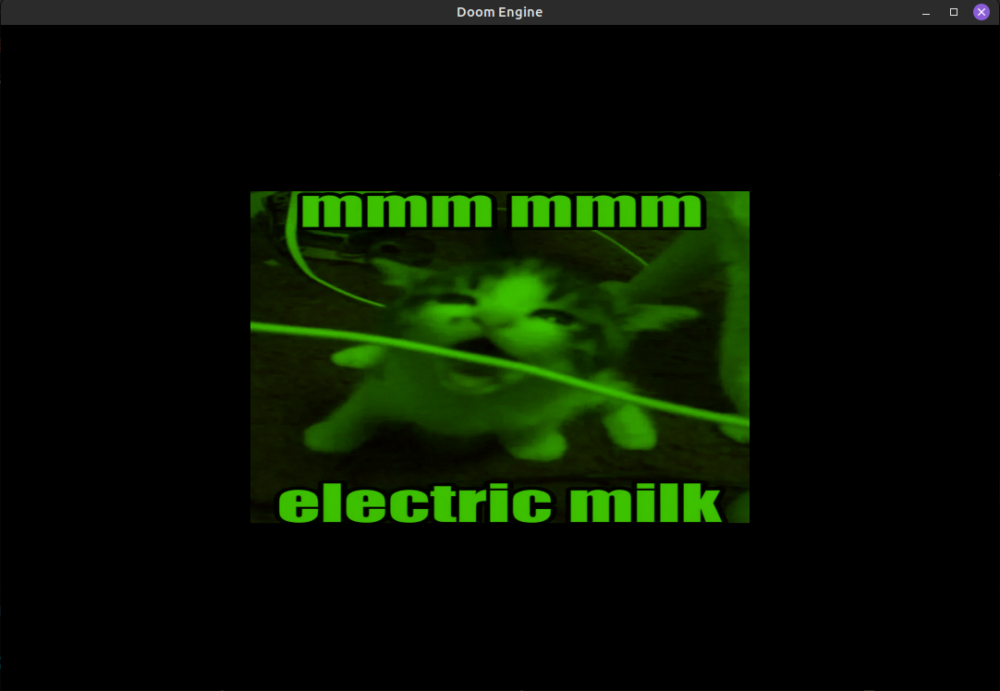

# doom-engine

OpenGL graphics engine in Rust

## Progress

Got some structs and methods for Buffer and Array Objects, Textures, etc.

Got matrices and vectors for calculations

Currently doing task 3 (learning imgui)

## Demos

Fragment coloring and quads

Perspective and transformations

<https://www.youtube.com/watch?v=HQWcm3fZbdE>
